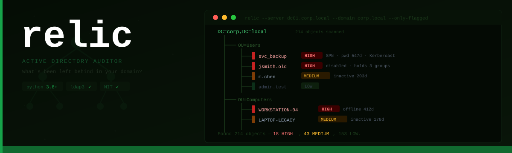
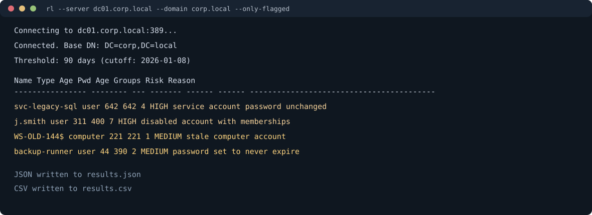
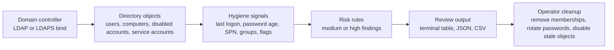

# relic

Find the Active Directory objects that stuck around longer than the process that created them.

Active Directory environments collect leftovers. Users leave, accounts stay. Service accounts outlive the projects that created them. Workstations get decommissioned, but their computer objects still sit in the directory, still in scope for policy and still appearing in group memberships. relic connects to a domain controller over LDAP and shows what is there, how old it is, and why it may deserve review.


## Demo



In a synthetic 200-object Active Directory test environment, relic surfaced 12 HIGH findings: 4 disabled accounts still holding group memberships, 3 service accounts with SPNs and passwords unchanged beyond 365 days, and 5 computer accounts inactive beyond one year. An additional 9 MEDIUM findings covered accounts with non-expiring passwords and dormant users. Total scan time under 8 seconds over a local LDAP connection.

More context is available in [docs/demo.md](docs/demo.md).

## What It Finds

**Stale computer accounts** — computers that have not authenticated since the threshold. Computer accounts authenticate when the machine starts and periodically during operation. A computer that has been silent for months either no longer exists or is no longer receiving policy.

**Dormant user accounts** — users who have not logged in within the threshold window. Includes service accounts identified by the presence of `servicePrincipalName`.

**Disabled accounts with group memberships** — the most immediately actionable finding. The account is already disabled, but its group memberships are still live. Reviewing and removing unnecessary memberships closes a re-enablement path.

**Accounts with non-expiring passwords** — `DONT_EXPIRE_PASSWORD` set in `userAccountControl`. Flagged on its own as MEDIUM; escalates to HIGH when the account is also stale.

**Service accounts with aging passwords** — accounts with SPNs whose `pwdLastSet` is older than the threshold are flagged as Kerberoasting exposure. A service account with an SPN and a multi-year-old password is a target regardless of whether the account appears active.

## Scan Flow



## Risk Levels

| Condition | Severity |
|---|---|
| Disabled account still holds group memberships | HIGH |
| Service account (SPN), password unchanged >365 days | HIGH |
| Computer account inactive >365 days | HIGH |
| Non-expiring password + inactive >180 days | HIGH |
| Stale user or computer account | MEDIUM |
| Non-expiring password (active account) | MEDIUM |
| Disabled account, no group memberships | MEDIUM |
| Service account password unchanged >90 days | MEDIUM |

## Usage

```bash
# Full scan — all object types
rl -s dc01.corp.local --domain corp.local
relic --server dc01.corp.local --domain corp.local

# Show only HIGH and MEDIUM findings
rl -s dc01.corp.local --domain corp.local -F
relic --server dc01.corp.local --domain corp.local --only-flagged

# Adjust the inactivity threshold
rl -s dc01.corp.local --domain corp.local -d 180

# Target specific object types
rl -s dc01.corp.local --domain corp.local -U --disabled

# Write reports
rl -s dc01.corp.local --domain corp.local -o results.json --output-csv results.csv

# Use LDAPS and an explicit base DN
rl -s dc01.corp.local --ssl --base-dn "DC=corp,DC=local"

# Disable flagged objects (dry run first)
rl -s dc01.corp.local --domain corp.local --disable -n
rl -s dc01.corp.local --domain corp.local --disable
```

## Authentication

```bash
# Simple bind (username + password from environment)
export RELIC_BIND_PASSWORD="<pass>"
rl -s dc01.corp.local --domain corp.local -u svc_relic --password-env RELIC_BIND_PASSWORD

# NTLM
rl -s dc01.corp.local -u "CORP\svc_relic" --password-env RELIC_BIND_PASSWORD --base-dn "DC=corp,DC=local"
```

PowerShell equivalent:

```powershell
$env:RELIC_BIND_PASSWORD = "<pass>"
rl -s dc01.corp.local --domain corp.local -u svc_relic --password-env RELIC_BIND_PASSWORD
```

LDAPS (`--ssl` or `--port 636`) is recommended to avoid transmitting credentials in cleartext. `-P` still works for quick local testing, but `--password-env` or `--password-stdin` is safer for repeatable runs.

## Short Flags

| Short | Long | Description |
|---|---|---|
| `-s HOST` | `--server HOST` | Domain controller hostname or IP |
| `-u USER` | `--username USER` | Bind username |
| `-P PASS` | `--password PASS` | Bind password |
|  | `--password-env VAR` | Read bind password from environment variable |
|  | `--password-stdin` | Read bind password from stdin |
| `-p N` | `--port N` | LDAP port (default: 389) |
| `-d N` | `--days N` | Inactivity threshold in days |
| `-U` | `--users` | Scan user accounts |
| `-C` | `--computers` | Scan computer accounts |
| `-o FILE` | `--output FILE` | Write JSON report to FILE |
| `-F` | `--only-flagged` | Show MEDIUM and HIGH only |
| `-q` | `--quiet` | Summary only, no table |
| `-n` | `--dry-run` | Report without making changes |

## Scan Flags

| Flag | What it scans |
|---|---|
| *(default — no flags)* | All object types |
| `--users` | Dormant user accounts |
| `--computers` | Stale computer accounts |
| `--disabled` | Disabled accounts with group memberships |
| `--never-expires` | Accounts with non-expiring passwords |

## Output Fields

JSON and CSV output includes: `name`, `type`, `dn`, `last_logon_str`, `age_days`, `pwd_age_days`, `disabled`, `never_expires`, `group_count`, `risk`, `risk_reasons`, `os`, `description`.

## Installation

```bash
git clone https://github.com/srkyn/relic.git
cd relic
pip install .
rl --version
```

Or run directly:

```bash
pip install ldap3 tabulate
python relic.py --server dc01.corp.local --domain corp.local --dry-run
```

## Comparison to lapse

relic and [lapse](https://github.com/srkyn/lapse) solve the same class of problem in different environments. lapse targets Entra ID (cloud) via Microsoft Graph API. relic targets on-premises Active Directory via LDAP. Between them they cover identity hygiene across both environments.

## Files

- `relic.py`: the scanner
- `docs/demo.md`: sanitized example output and interpretation
- `tests/test_relic.py`: unit tests (48 cases)
- `docs/design-notes.md`: implementation details and limitations
- `CHANGELOG.md`: release history

## Limitations

- `lastLogonTimestamp` replication lag means age readings may be off by up to 14 days.
- Does not evaluate nested group membership chains.
- Does not parse password policy to determine actual expiry status.
- Does not support Kerberos/GSSAPI authentication.
- May miss objects in OUs the bind account cannot read.
- Read-only except when `--disable` is used.

## Testing

```bash
python -m py_compile relic.py
python -m unittest discover -s tests -v
rl --version
```
